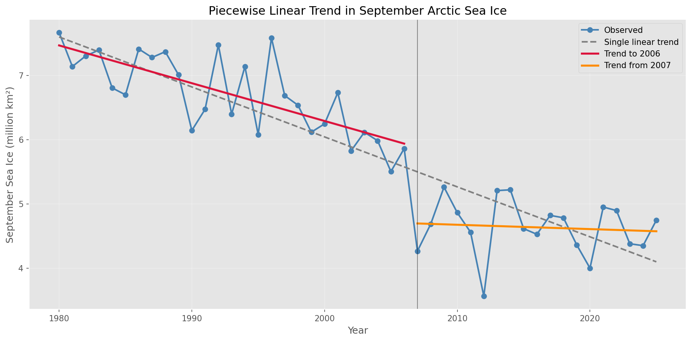
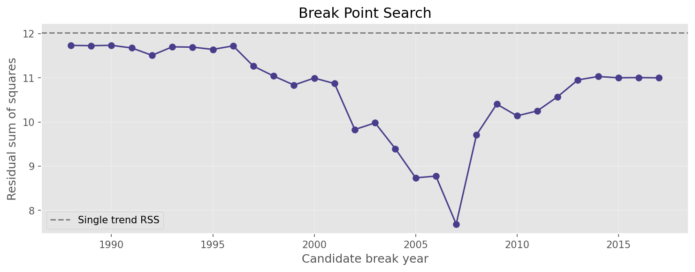
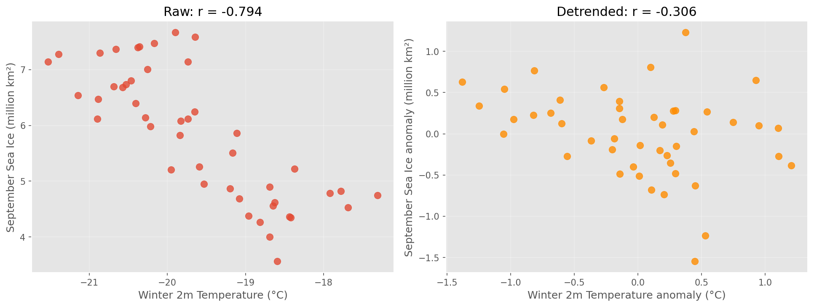
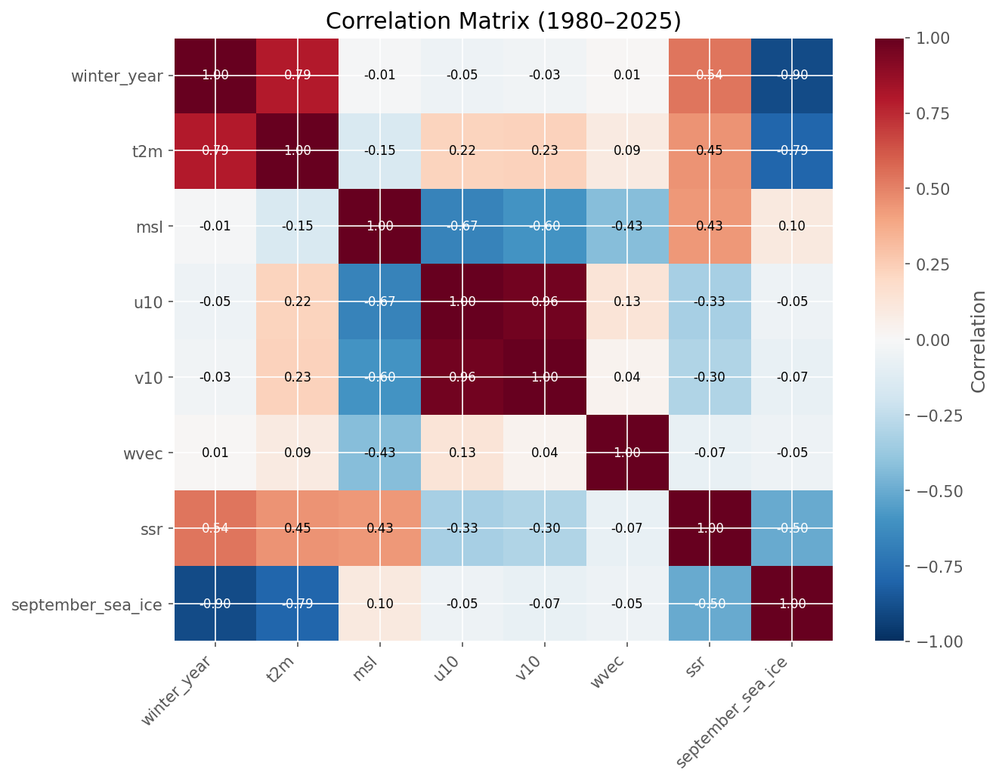
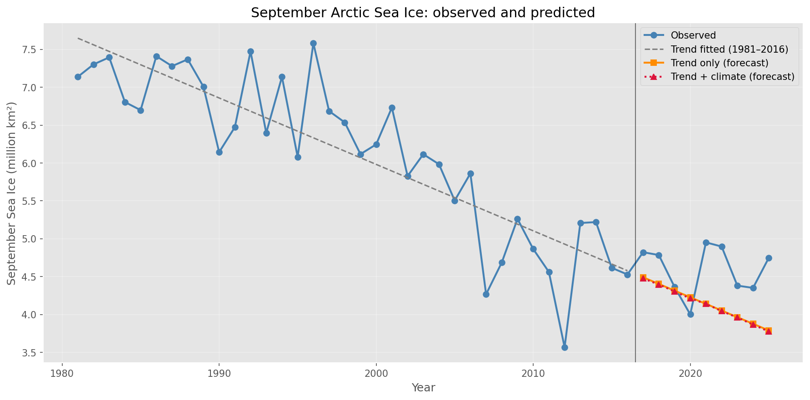
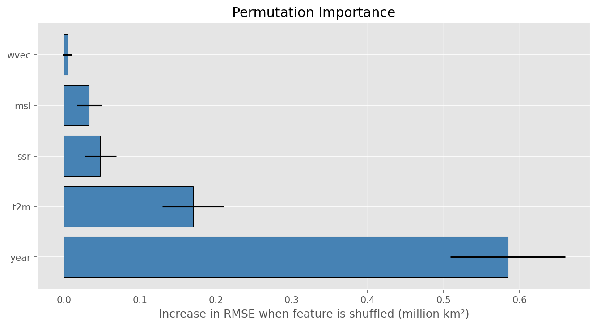

# Arctic Sea Ice: A Structural Break in 2007

**Testing whether winter climate indices predict September Arctic sea ice extent, and finding that the standard trend baseline is misspecified.**

---

## Summary

September Arctic sea ice extent has declined dramatically over the satellite era, and forecasting the annual minimum remains an open problem. This project asked a simple question: do winter climate conditions over the Arctic carry information about the following September's sea ice extent?

The answer is no. But establishing that led to a more useful finding.

**Two results:**

1. **Winter climate variables add nothing beyond the sea ice record itself.** Their apparent correlations with September extent are largely artefacts of shared trends. A regularised model given the trend and asked to explain only departures from it adjusted its predictions by a mean of **0.0096 million km²**, effectively declining to use the climate information at all.

2. **The linear trend baseline is itself misspecified.** A structural break in **2007** separates a period of significant decline from one with **no detectable trend**. Correcting for this reduces hold out forecast error by **37%**.

The second result reframes the first. Part of what looked like a limit on predictability was a poorly specified reference model.

---

## Headline numbers

| Quantity | Value |
|---|---|
| Study period | 46 winters, 1980 to 2025 |
| Trend, 1980 to 2006 | decline of 0.588 million km² per decade |
| Trend, 2007 to 2025 | decline of 0.067 million km² per decade (p = 0.717, **not significant**) |
| Chow test for break at 2007 | F = 11.83, **p = 0.0001** |
| BIC difference (two segment vs single trend) | **9.06 in favour of the break** |
| Hold out RMSE, single linear trend | 0.573 million km² |
| Hold out RMSE, piecewise trend | **0.361 million km² (37% lower)** |
| Climate variable contribution to forecast | 0.0096 million km² |

---

## The central finding



A single linear trend (grey dashed) fits neither regime. It runs below the observations before 2007 and below them again afterwards, then extrapolates a decline rate that stopped applying eighteen years ago.

Fitted separately, the two segments tell a different story: steep decline to 2006 (red), and essentially flat thereafter (orange). The post 2007 slope is a decline of 0.067 million km² per decade with a standard error of 0.183, statistically indistinguishable from zero across 19 observations.

### The break point is well identified



Residual sum of squares across every candidate break year. The minimum at 2007 is sharp and isolated: 7.688, against 8.78 at 2006 and 9.71 at 2008. Not a shallow valley where the choice would be arbitrary.

The break was found by unguided search over all candidate years, with no prior knowledge of Arctic history. It landed on 2007, the year of the first major Arctic sea ice collapse, when September extent fell to 4.27 million km² and broke the previous record by a wide margin.

**Robustness:** the search returns 2007 for minimum segment lengths of 5, 8 and 10 years, with identical test statistics.

---

## Why the climate variables fail

### Correlations are trend artefacts



Left: winter 2 m temperature against September sea ice extent. A clear downward band, r = 0.794 negative. Right: the same data with the linear trend removed from both series. A diffuse cloud, r = 0.306 negative.

Roughly three quarters of the apparent relationship was shared trend. And the residual does not survive scrutiny: at p = 0.039 with six variables tested, a Bonferroni corrected threshold of 0.0083 is required.

| Variable | r (raw) | p | r (detrended) | p | r with year |
|---|---|---|---|---|---|
| t2m | 0.794 neg | <0.001 | 0.306 neg | 0.039 | 0.793 |
| msl | 0.095 | 0.528 | 0.197 | 0.190 | 0.009 neg |
| u10 | 0.049 neg | 0.747 | 0.217 neg | 0.147 | 0.053 neg |
| v10 | 0.072 neg | 0.633 | 0.231 neg | 0.122 | 0.034 neg |
| wvec | 0.050 neg | 0.741 | 0.094 neg | 0.535 | 0.010 |
| ssr | 0.502 neg | <0.001 | 0.057 neg | 0.706 | 0.537 |

**Surface solar radiation is the clearest case.** A raw correlation of 0.502 negative (p = 0.0004) collapses to 0.057 negative (p = 0.71) once detrended. Winter Arctic solar radiation is governed almost entirely by orbital geometry and varies by about 2% across the record (standard deviation 0.26 W m⁻² on a mean of 10.8). Its slight upward drift, plausibly the ice albedo feedback, is enough to manufacture a significant looking association with a target that has halved.

### The correlation structure



Two features drive the modelling decisions. The variable `winter_year` correlates 0.896 negative with sea ice and 0.793 with temperature, so time dominates the dataset. And `u10` and `v10` correlate at **0.965**, severe multicollinearity, which is why wind is represented by the magnitude of the mean wind vector instead.

### No model beats a straight line through time

Expanding window cross validation, 5 folds, mean across folds:

| Model | RMSE | MAE | Skill vs trend |
|---|---|---|---|
| **Trend only** | **0.663** | 0.564 | 0.000 |
| Persistence | 0.684 | 0.561 | 0.032 worse |
| Trend plus climate anomaly | 0.664 | 0.565 | 0.002 worse |
| t2m plus year | 0.713 | 0.619 | 0.075 worse |
| Climate plus trend | 0.751 | 0.667 | 0.133 worse |
| Climate only | 0.957 | 0.860 | 0.443 worse |
| Climatology | 1.300 | 1.239 | 0.961 worse |

The decisive row is **trend plus climate anomaly**: hand the model the trend for free, ask it to explain only the departures. Result 0.664 against the baseline's 0.663, a skill score of 0.002 worse than doing nothing. Ridge regression shrank every climate coefficient to near zero on every fold.

Note that **climate plus trend performs worse than trend alone**. With 46 observations, four extra parameters cost more in variance than they return in signal.

### The forecast failure, visualised



The orange and crimson lines are indistinguishable. That is the 0.0096 million km² adjustment. Both descend while the observations plateau between 4.00 and 4.95. Hold out errors grow from 0.33 in 2017 to 0.96 in 2025.

### Explanatory contribution is not predictive skill



Year dominates at 0.585. Winter temperature is measurable but secondary at 0.170 plus or minus 0.041, and the wind index is negligible at 0.004 plus or minus 0.006, an interval spanning zero.

There is an apparent tension here: temperature has real permutation importance yet adds nothing in cross validation. The two measure different things. Permutation importance asks how much a model *fitted to the full record* relies on a variable. Cross validation asks whether that reliance *helps on unseen years*. Because winter temperature correlates 0.793 with time, the fitted model uses it as a partial proxy for the trend, information that is redundant out of sample.

---

## Method

**Data**

- **Sea ice:** NSIDC Sea Ice Index v4, Northern Hemisphere monthly extent ([DOI: 10.7265/a98x-0f50](https://doi.org/10.7265/a98x-0f50))
- **Climate:** ERA5 monthly averaged reanalysis on single levels, 60°N to 90°N ([Copernicus CDS](https://cds.climate.copernicus.eu/datasets/reanalysis-era5-single-levels-monthly-means))
- **Predictors:** 2 m temperature, mean sea level pressure, 10 m wind, surface net solar radiation, averaged over December to March
- **Target:** the following September's sea ice extent

**Choices that shaped the results**

*Area weighted spatial averaging.* Grid cell area on a regular latitude longitude grid scales with the cosine of latitude. An unweighted mean gives the tiny cells near the pole the same influence as the large bands at 60°N. Weighting **lowers** the winter mean temperature by 1.87 °C, because in Arctic winter the coldest regions in the domain are the Siberian and North American land masses to the south, not the central Arctic Ocean, where heat flux through the ice keeps the surface comparatively warm.

*Complete winters only.* December is assigned to the following winter so all predictors precede the target. Winter 1979 is excluded: December 1978 falls outside the downloaded period, and since December is the darkest month of the Arctic year, omitting it inflated that season's solar radiation to **5.8 standard deviations** above the mean, at the first point in the record, where regression leverage is highest.

*Wind as vector magnitude.* Averaging the signed components across the Arctic cancels opposing flows toward zero (means of 0.17 and 0.08 negative m s⁻¹). The magnitude of the mean wind vector preserves the persistent flow signal.

*Chronological evaluation.* TimeSeriesSplit with 5 expanding windows. No future data ever enters training.

*RMSE rather than R².* Recent September extent occupies a narrow range: the 2017 to 2025 hold out has a standard deviation of 0.31 million km². R² divides by that small variance and becomes unstable. An early version of this analysis produced an R² of 5.5 negative, which reflects the metric more than the model.

---

## Reproducing

```bash
git clone https://github.com/Shweta-Portfolio/<repo-name>.git
cd <repo-name>
pip install pandas numpy matplotlib scipy scikit-learn xarray netCDF4 openpyxl
```

Then download the two source datasets (free registration required for ERA5) and update the file paths at the top of the notebook. Run top to bottom.

---

## Limitations

**Spatial aggregation.** Each variable is one basin wide mean. Regional signals such as Barents Sea inflow, the Beaufort Gyre and the Arctic front average out entirely. The null result was obtained at the coarsest possible aggregation.

**Sea ice thickness is absent.** Thickness and volume carry information about the ice's capacity to survive the melt season that extent does not. This is the most substantial gap in the predictor set, and the change most likely to alter the negative conclusion.

**Sample size.** 46 annual observations is an inherent constraint of the satellite record.

**Break point selection.** The break was identified using the full record and evaluated on a subset of it, introducing some optimism into the 37% figure. The break year (2007) and evaluation period (2017 to 2025) are disjoint, and the 2007 event is independently documented, but this is an in sample estimate rather than fully independent validation.

**Nineteen years is not long.** Whether the post 2007 plateau represents a durable regime change or a pause within continued decline cannot be settled with this record.

---

## Further work

1. **Independent validation.** Identify the break using data to a fixed cut off, then forecast years never used in the search.
2. **Characterise the post 2007 regime.** If there is no trend, the right model is a description of variability about a mean, not a slope.
3. **Regional and sub seasonal predictors.** Test whether the signal exists but is destroyed by averaging.
4. **Add sea ice thickness.** The most promising route to overturning the null result.

---

## Note on the negative result

Seasonal prediction of September Arctic sea ice is a recognised open problem. Operational centres running full coupled climate models achieve limited skill against trend and persistence baselines at comparable lead times. The finding that four Arctic wide winter means carry no exploitable interannual signal is consistent with that.

The result is reported as it stands. The raw correlation of 0.794 negative between winter temperature and September extent would, without detrending, have supported a much more confident and much less accurate claim.
